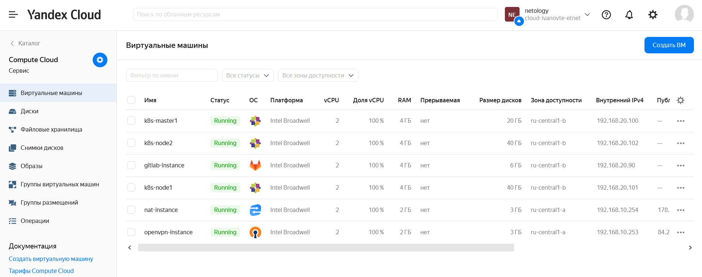
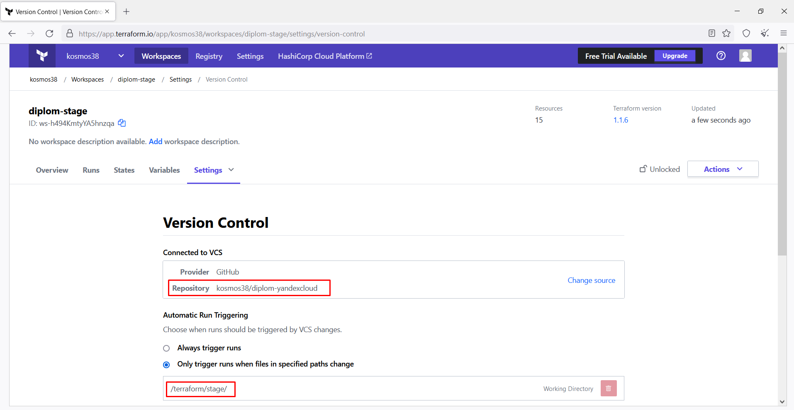
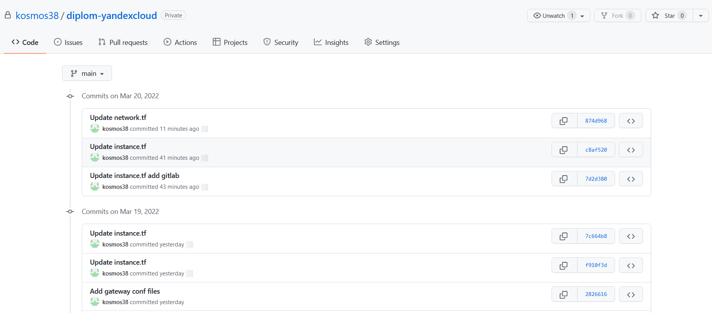
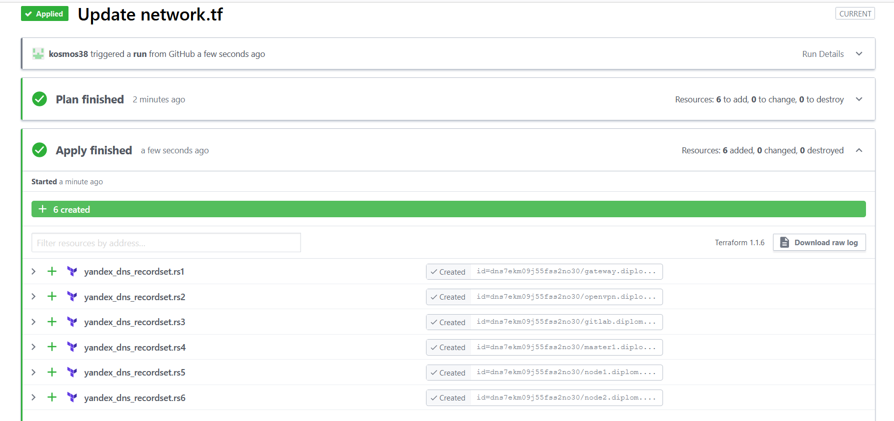
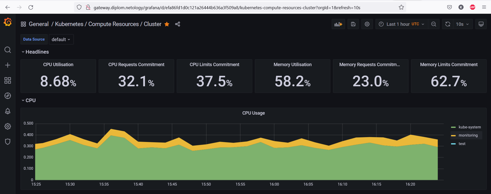

# Дипломный блок профессии DevOps-инженер
# Студент Иванов Антон

В данном репозитории находится только теоритическая часть и описание инфраструктуры.
Все конфигурационные файлы расположены в [приватном репозитории](https://github.com/kosmos38/diplom-yandexcloud), ссылку и доступ преподавателю предоставил лично.

## Создание облачной инфраструктуры
Инфраструктура состоит из:

    * nat-instance      gateway, bastionб NAT и единая точка входа из внешнего мира
    * openvpn-instance  vpn сервер для доступа к закрытой части сети
    * k8s-master1       мастер кластера kubernetes
    * k8s-node1         worker node kubernetes
    * k8s-node2         worker node kubernetes
    * gitlab-instance   сервер GitLab

Скриншот получившейся инфраструктуры в Яндекс.Облако:
​

Все ресурсы создаются с помощью terraform с использованием Terraform Cloud в качестве backend с привязкой к репозиторию. Конфигурационный файл разбит на файлы:

    * main.tf       описание провайдера и бэкенда
    * instance.tf   описание выделяемых серверов
    * network.tf    описание приватной, частной сети, создание ДНС записей и маршрутов

Скриншот проекта в Terraform Cloud:
​

Коммиты в репозиторий привязанный к terraform, с изменениями инфраструктуры:
​

Применение изменений в репозитории со стороны Terraform Cloud:
​

## Задание 1. Яндекс.Облако

Основной файл конфигурации: [main.tf](main.tf.pub)

Файл конфигурации с nat-instance и instance-group: [instance.tf](instance.tf.pub)

Для передачи index.html и ssh ключей использовал файл: [user-kosmos-vm.yaml](user-kosmos-vm.yaml.pub)

При привязке load-balancer к target-group с виртуалками из instance-group столкнулся с проблемой, terraform ругается на отсутвтвие ресурса target-group.id, если же создать отдельный ресурс target-group, то instance-group далее ругается на то что target-group с таким названием уже существует при добавлении ВМ в эту группу...
Решение в документации увидел только одно, целиться на подсеть или отдельные ip адреса, но это не совсем правильно, поэтому сделал "полуавтоматический режим":

    * Балансировщник создаю через terraform
    * target-group при создании instance-group через terraform
    * Добавление target-group в балансировщик через веб консоль

### Скриншоты результатов выполнения:

​