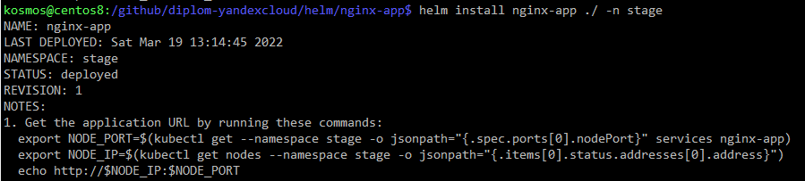
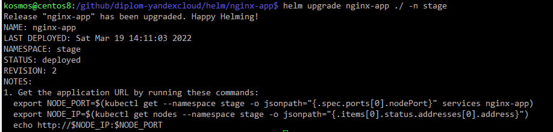

# Дипломный блок профессии DevOps-инженер
# Студент Иванов Антон

В данном репозитории находится только теоритическая часть и описание инфраструктуры.
Все конфигурационные файлы расположены в [приватном репозитории](https://github.com/kosmos38/diplom-yandexcloud), ссылку и доступ преподавателю предоставил лично.

Внешняя ссылка на тестовое приложение:
http://diplom.helpdesk38.ru/

Внешняя ссылка на мониторинг grafana:
http://diplom.helpdesk38.ru/grafana/

Список рекомендуемых DNS А-записей в hosts файл, для доступа к внутренним ресурсам инфраструктуры:

        192.168.10.253  openvpn.diplom.netology
        192.168.10.254  gateway.diplom.netology
        192.168.20.90   gitlab.diplom.netology
        192.168.20.100  master1.diplom.netology
        192.168.20.101  node1.diplom.netology
        192.168.20.102  node2.diplom.netology

## Создание облачной инфраструктуры
Конфигарционные файлы в директории [terraform/stage](https://github.com/kosmos38/diplom-yandexcloud/tree/main/terraform/stage), приватного репозитория.

Инфраструктура состоит из:

    * nat-instance      gateway, bastionб NAT и единая точка входа из внешнего мира
    * openvpn-instance  vpn сервер для доступа к закрытой части сети
    * k8s-master1       мастер кластера kubernetes
    * k8s-node1         worker node kubernetes
    * k8s-node2         worker node kubernetes
    * gitlab-instance   сервер GitLab

Скриншот получившейся инфраструктуры в Яндекс.Облако:
​

Все ресурсы создаются с помощью terraform с использованием Terraform Cloud в качестве backend с привязкой к репозиторию. 

Конфигурационный файл разбит на файлы:

    * main.tf       описание провайдера и бэкенда
    * instance.tf   описание выделяемых серверов
    * network.tf    описание приватной, частной сети, создание ДНС записей и маршрутов

Скриншот проекта в Terraform Cloud:
​

Коммиты в репозиторий привязанный к terraform, с изменениями инфраструктуры:
​

Применение изменений в репозитории со стороны Terraform Cloud:
​

## Создание Kubernetes кластера

Кластер устанавливал самостоятельно при помощи готовой ansible конфигурации kubespray. 
Конфигарционные файлы находятся в директории [kubespray](https://github.com/kosmos38/diplom-yandexcloud/tree/main/kubespray), приватного репозитория.

Скриншот успешной установки с помощью kubespray:
​

Скриншот успешного выполнения kubectl get po -A, .kube/config настроен:
​

Дополнительно для удобства администрирования установил Lens на локальную машину:
​

## Создание тестового приложения

В директории [app](https://github.com/kosmos38/diplom-yandexcloud/tree/main/app) приватного репозитория расположен Dockerfile и статическая веб страница, которая используется при сборке образа, образ опубликован в [DockerHub ](https://hub.docker.com/r/kosmos38/nginx_app)

## Подготовка cистемы мониторинга и деплой приложения

### Мониторинг
Стек системы мониторинга был установлен в кластер при помощи оператора prometheus-operator с использованием helm charts, после установки были внесены изменения в сетевые сервисы, [манифесты здесь](https://github.com/kosmos38/diplom-yandexcloud/tree/main/prometheus-stack).

Внешняя ссылка на мониторинг grafana:
http://diplom.helpdesk38.ru/grafana/

Скриншот обзорного dashboard в grafana:
​

Скриншот dashboard с загрузкой нод кластера:
​

### Деплой приложения
Деплой приложения в кластер осуществил при помощи helm chart, конфигурационные файлы в директории [helm/app](https://github.com/kosmos38/diplom-yandexcloud/tree/main/helm/nginx-app)

Внешняя ссылка на тестовое приложение:
http://diplom.helpdesk38.ru/

Скриншот с установкой приложения:
​

Скриншот с изменением развертывания приложения:
​

## Установка и настройка CI/CD

Для организации процессов CI/CD я выбрал Gitlab и развернул его в инфраструктуре отдельным инстансом, gitlub-runner запускается в кластере kubernetes.
